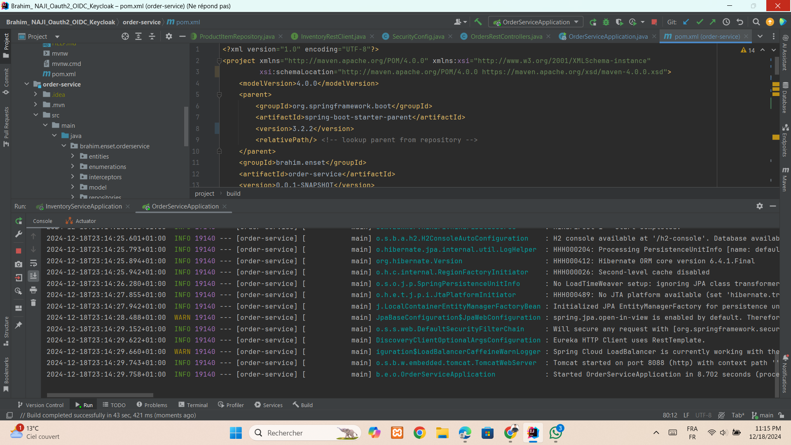

# TP sécurisation backend frontend avec keycloak
### Configuration de keycloak 

Création de client :

Création des utilisatuers :

Création des roles :

Assigner un Role :

Création de mot de passe :

Test avec postman :

### Service : inventory service 

test de service :
Sans JWT :

Avec JWT :

### Service : Order service

